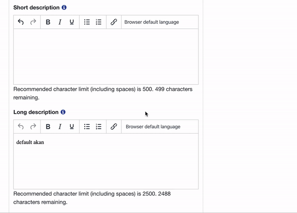

# Description

This is a plugin for TinyMCE 5 that allows users to specify what language their text is written in. The plugin wraps
 the desired text in `span` tags with a `lang` attribute for the specified language. Unspecified text is assumed to be
  written in the page's language.

# Usage

Import the plugin to add it to TinyMCE's plugin manager:

`import 'tinymce-language-selector'`

Make sure TinyMCE has already been imported since the plugin needs access to the global `tinymce` variable.

Then you can use the plugin just like one of TinyMCE's builtin plugins. When configuring TinyMCE, make sure to modify
 `extended_valid_elements` to allow `span` tags with the `lang` attribute or the `id` attribute and to strip empty `span
 ` tags:

`extended_valid_elements: 'span[lang|id] -span'`